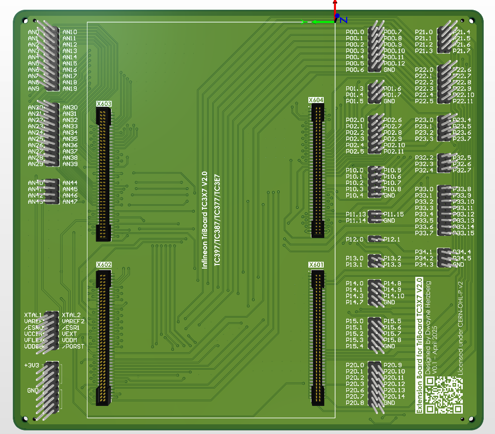

# Triboard-TC3X7-Extension

The **Extension Board for TriBoard TC3X7 V2.0** is an extender board designed for use with the [Infineon AURIX™ TC3X7 TriBoard](https://www.infineon.com/dgdl/Infineon-TriBoardManual_TC3X71-UserManual-v02_01-EN.pdf?fileId=5546d462696dbf1201697775dd0b58be). It is 4-layer board based on JLC04161H-7628 standard stackup

It provides male headers for easy access to each IO and AN (Analog Input) pin from the four 80-pin connectors available on the original TriBoard.

✅ Fully compatible with:
- **TC397**
- **TC387**
- **TC377**
- **TC3E7**

⚠️ **Not compatible with**:
- **TC327**
- **TC337**
- **TC367**

**Reference**: [Infineon TriBoard Manual TC3X7](https://www.infineon.com/dgdl/Infineon-TriBoardManual_TC3X71-UserManual-v02_01-EN.pdf?fileId=5546d462696dbf1201697775dd0b58be)

Here is a 3D model preview of the PCB layout:

## Project Contents

- **Altium Source Files** – Schematic and PCB Layout
- **Symbol & Footprint Libraries** – Custom libraries used in the design
- **Manufacturing Files** – Gerber files for PCB production
- **Assembly Files** – BOM (Bill of Materials) and Pick & Place files for assembly

## 📢 Important Notes

- **Samtec FTSH-140-02-L-DV-ES-A connectors**
  - ⚠️ These connectors are **expensive (~7.5€ each)** and **currently out of stock** at some suppliers like JLCPCB.
  > A pre-order has been made. once assembled, total board + assembly cost will be indicated.
- **Project Status**:
  - The board design is **complete**, but the hardware has **NOT yet been tested**.
  - Assembly and validation are **ongoing**.

## License

This project is licensed under the [CERN Open Hardware Licence Version 2 – Permissive (CERN-OHL-P v2)](https://cern-ohl.web.cern.ch/).

Please refer to the `LICENSE.txt` file for full details.

---

**Dwayne Herzberg**  
Email: [dwayneherzberg@gmail.com](mailto:dwayneherzberg@gmail.com)

