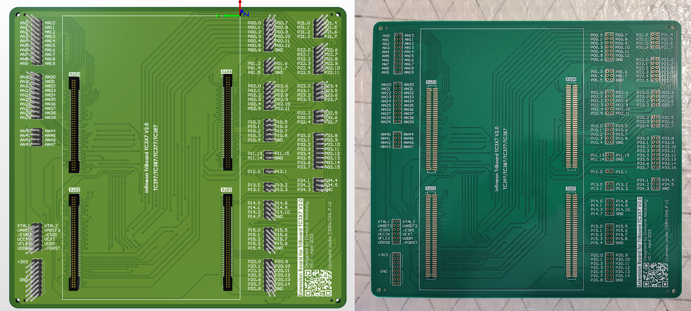

# Triboard-TC3X7-Extension

The **Extension Board for TriBoard TC3X7 V2.0** is an extender board designed for use with the [Infineon AURIX™ TC3X7 TriBoard](https://www.infineon.com/dgdl/Infineon-TriBoardManual_TC3X71-UserManual-v02_01-EN.pdf?fileId=5546d462696dbf1201697775dd0b58be). It is 4-layer board based on JLC04161H-7628 standard stackup

It provides male headers for easy access to each IO and AN (Analog Input) pin from the four 80-pin connectors available on the original TriBoard.

✅ Fully compatible with:
- **TC397**
- **TC387**
- **TC377**
- **TC3E7**

⚠️ **Not compatible with**:
- **TC327**
- **TC337**
- **TC367**

**Reference**: [Infineon TriBoard Manual TC3X7](https://www.infineon.com/dgdl/Infineon-TriBoardManual_TC3X71-UserManual-v02_01-EN.pdf?fileId=5546d462696dbf1201697775dd0b58be)

Here is a 3D model preview of the PCB layout:

## Project Contents

- **Altium Source Files** – Schematic and PCB Layout
- **Symbol & Footprint Libraries** – Custom libraries used in the design
- **Manufacturing Files** – Gerber files for PCB production
- **Assembly Files** – BOM (Bill of Materials) and Pick & Place files for assembly

## Production Cost

### PCB Manufacturing
- PCBs were manufactured by **JLCPCB**.
- Total cost: **around 70 € for 5 boards** (including shipping and taxes).

### Parts Cost (per board)

| Ref                    | Qty | Total (SAMTEC) | Total (DIGIKEY) |
|------------------------|-----|----------------|------------------|
| TSW-105-07-F-D         | 2   | 1.02 €         | 0.94 €           |
| TSW-102-07-F-D         | 2   | 0.41 €         | 0.38 €           |
| TSW-107-07-F-D         | 2   | 1.43 €         | 1.34 €           |
| TSW-103-07-F-D         | 3   | 0.90 €         | 0.84 €           |
| FTSH-140-02-L-DV-ES-A  | 4   | 36.28 €        | 33.92 €          |
| TSW-110-07-F-D         | 2   | 1.99 €         | 1.86 €           |
| TSW-104-07-F-D         | 4   | 1.62 €         | 1.52 €           |
| TSW-106-07-F-D         | 3   | 2.65 €         | 2.49 €           |
| TSW-108-07-F-D         | 2   | 1.62 €         | 1.52 €           |
| TSW-101-07-F-D         | 1   | 0.20 €         | 0.18 €           |

Total Raw Part Cost (per board without shipping and taxes):
- From **SAMTEC**: **48.12 €**
- From **DIGIKEY**: **44.99 €**

Total Paid to DIGIKEY (with 1 extra FTSH to avoid shipping fees):
- Parts: 55.31 €
- VAT (TVA): 11.06 €
- Total Paid: **66.37 € for one board**

## License

This project is licensed under the [CERN Open Hardware Licence Version 2 – Permissive (CERN-OHL-P v2)](https://cern-ohl.web.cern.ch/).

Please refer to the `LICENSE.txt` file for full details.

---

**Dwayne Herzberg**  
Email: [dwayneherzberg@gmail.com](mailto:dwayneherzberg@gmail.com)

